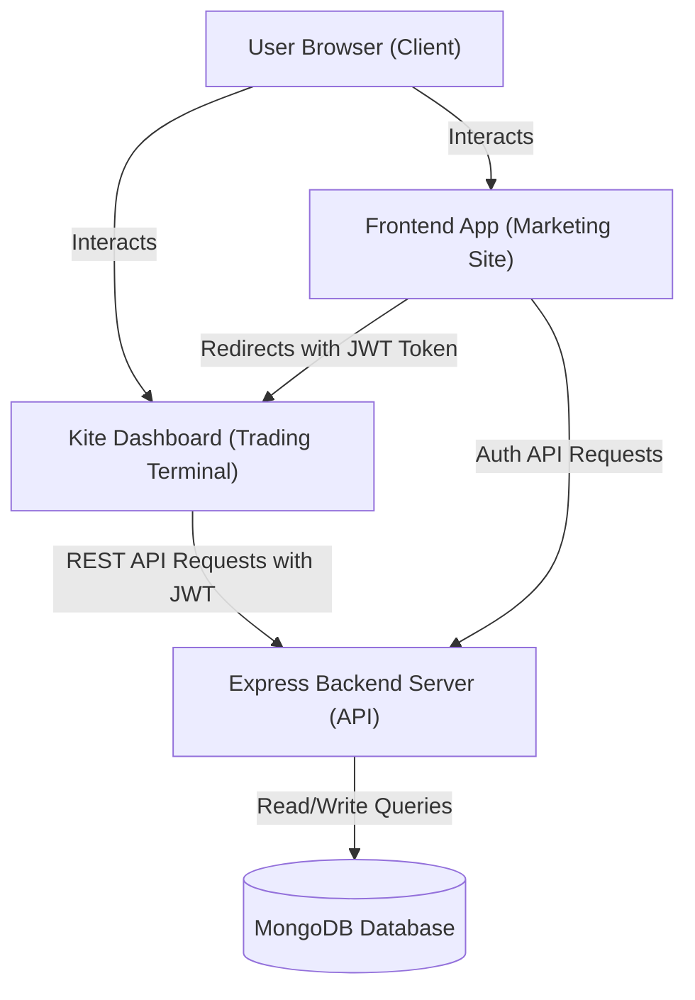
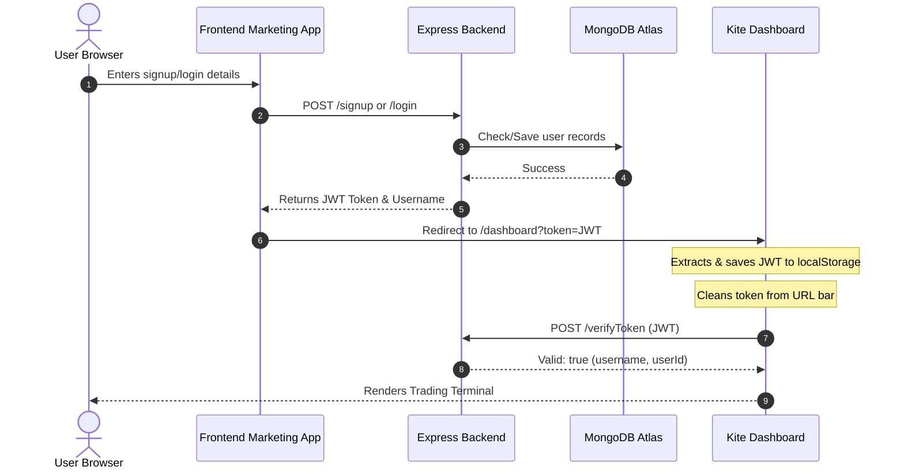
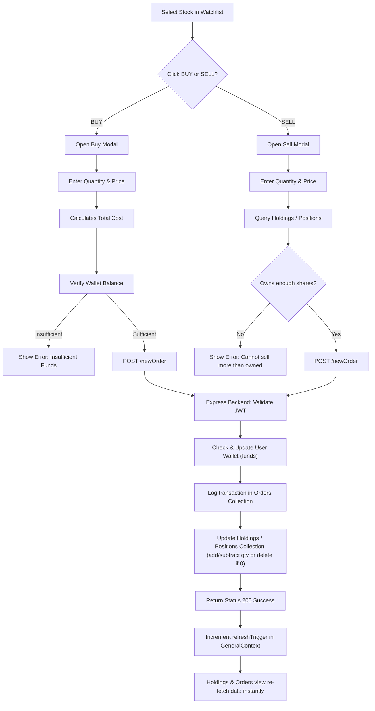

# 📈 Zerodha Clone (MERN Stack)

[](https://mongodb.com)
[](https://react.dev)
[](https://nodejs.org)
[](https://expressjs.com)
[](https://mongodb.com)
[](https://opensource.org/licenses/ISC)

A premium, full-stack clone of **Zerodha**, one of India's leading stock broking platforms. This application replicates the client-facing marketing landing page (promotional site) and the interactive trading terminal (**Kite** clone). 

It is built using the **MERN (MongoDB, Express.js, React.js, Node.js)** stack, featuring robust JWT session guards, real-time transaction logging, dynamic funds deposits/withdrawals, user-specific portfolios, and context-driven auto-refresh events.

---

## 📖 Table of Contents
1. [🏗️ Project Architecture & Hosting Models](#%EF%B8%8F-project-architecture--hosting-models)
2. [⚙️ Execution Modes](#%EF%B8%8F-execution-modes)
3. [🔄 System Diagrams & User Flow](#-system-diagrams--user-flow)
4. [🌟 Key Features](#-key-features)
5. [📁 Workspace Folder Structure](#-workspace-folder-structure)
6. [📊 Database Schemas](#-database-schemas)
7. [🔌 REST API Reference](#-rest-api-reference)
8. [📝 Configuration & Env Variables](#-configuration--env-variables)
9. [🚀 Installation & Setup Guide](#-installation--setup-guide)
10. [☁️ Production Deployment (Monolith Setup)](#%EF%B8%8F-production-deployment-monolith-setup)

---

## 🏗️ Project Architecture & Hosting Models

The application is structured as a **monorepo** consisting of three principal services:

1. **`frontend` (Public Marketing Portal)**: Recreates Zerodha's main landing pages (Home, About, Products, Pricing, Support, Sign Up / Log In).
2. **`dashboard` (Kite Trading Terminal)**: Recreates the trading portal where users monitor watchlist stocks, check holdings charts, track day positions, view orders, and manage funds.
3. **`backend` (API Server)**: Manages database connections, processes auth requests, performs order book transactions, and dynamically modifies wallets.

---

## ⚙️ Execution Modes

This project supports two execution modes:

### 1. Local Development Mode (Multi-Port Concurrent Servers)
During development, the frontend, dashboard, and backend run concurrently on separate local ports. This supports fast hot-reloading for code modifications:
* **Marketing Site (`frontend`)**: `http://localhost:3000`
* **Kite Trading Dashboard (`dashboard`)**: `http://localhost:3001` (configured with `BROWSER=none` to suppress duplicate browser tabs)
* **Express Server (`backend`)**: `http://localhost:3002`

### 2. Production Monolith Architecture (Single Port)
For cloud deployment (e.g., Render), the project builds as a single unified service. The Express backend serves the API endpoints *and* hosts the compiled static production builds for both React applications. This eliminates CORS complexities, reduces memory footprint, and binds to a single port.
* **Unified Domain**: Root route (`/`) serves the promotional site, and `/dashboard` serves the Kite Trading Terminal.

---

## 🔄 System Diagrams & User Flow

### 1. General System Architecture


### 2. Authentication & Session Handoff


### 3. Order Execution & State Update Lifecycle


---

## 🌟 Key Features

### 🔐 1. Authentication & Router Guards
* **Secure Registration**: Signup form collects Full Name, Email, Username, Mobile Number, and Password (with client-side input validations).
* **BCrypt Password Hashing**: Passwords are securely hashed using `bcryptjs` before storage in MongoDB.
* **JWT Session Tokens**: Successful authentication generates a JSON Web Token (`jsonwebtoken`). Token is handed over to the dashboard console via URL parameters upon redirection and stored securely in `localStorage`.
* **Security Guard Interceptor**: A route gate inside `Home.js` intercepts dashboard loads. If the token is invalid, expired, or missing, it alerts the user and redirects them back to the login page, blocking unauthorized access.

### 📈 2. Interactive Watchlist & Modals
* **Market Monitor**: Dynamic watchlist tracks real-time stock status (like `INFY`, `TCS`, `RELIANCE`) with color-coded percentage gains/losses.
* **Instant Buy / Sell Modals**: Hovering watchlist stock cards opens Kite-style action sheets.
* **Smart Cost Calculators**: Entering the transaction quantity automatically computes and pre-fills the total transaction price inside the price input based on the stock's Last Traded Price (LTP).
* **Custom Limit Orders**: Users can manually override the calculated price. The modal back-calculates the price-per-share before posting it to the database to preserve standard portfolio averages.

### 💼 3. User-Specific Portfolio Management
* **User-Filtered Orders**: The **Orders** page fetches only the logged-in user's transaction history using their decoded JWT ID.
* **Welcome Screen for New Users**: If a new user signs up, the orders table is empty and renders a fallback welcome screen (`"You haven't placed any orders today"`).
* **Asset Holdings Visualizer**: The holdings page retrieves portfolio assets and generates a dynamic visual distribution bar/doughnut chart using `Chart.js`.
* **Day Positions Ledger**: Day trades summary, daily returns, and P&L tracking.
* **Portfolio Verification on Sell**: The Sell modal queries holdings and positions. It verifies ownership and restricts selling more shares than the user currently owns.

### 💰 4. Interactive Wallet & Funds Manager
* **Available Margins**: Balance tracking displaying available margins and cash limits in Indian Rupee format (`₹XX,XX,XXX.XX`).
* **Add Funds Portal**: Interface to instantly deposit mock cash into the MongoDB user document.
* **Withdrawals Portal**: Form to withdraw funds. Validates withdraw limits to block withdrawing more cash than available.
* **Auto-Deductions**: Buying stocks automatically deducts the cash from the user's wallet. Selling stocks credits the proceeds back to their balance.
* **Self-Healing Wallets**: Automatically migrates and populates the starting balance (`₹1,00,000.00`) on older test accounts that don't have the `funds` field.

### 🔄 5. Context-Driven Auto Refresh
* Wrapped the entire dashboard router inside a unified React context provider (`GeneralContext.js`).
* Placing an order increments a global `refreshTrigger` state once the backend returns a `200` success response.
* The `Orders` and `Holdings` sections subscribe to this context trigger, automatically refreshing their tables instantly without requiring a full browser page reload.

---

## 📁 Workspace Folder Structure

```text
Zerodha_clone/
├── backend/                       # Node/Express API Server
│   ├── model/                     # Mongoose Models
│   │   ├── HoldingsModel.js
│   │   ├── OrdersModel.js
│   │   ├── PositionsModel.js
│   │   └── UserModel.js
│   ├── schemas/                   # Mongoose Database Schemas
│   │   ├── HoldingsSchema.js
│   │   ├── OrdersSchema.js
│   │   ├── PositionsSchema.js
│   │   └── UserSchema.js
│   ├── index.js                   # Main Server Entrypoint & Monolithic Routes
│   ├── package.json
│   └── .env                       # Backend Env Configuration
├── dashboard/                     # Kite Trading Terminal (React App)
│   ├── public/                    # Static Assets
│   ├── src/
│   │   ├── components/            # Dashboard Views & Core Widgets
│   │   │   ├── Funds.js           # Add/Withdraw Funds Panel
│   │   │   ├── GeneralContext.js  # Context provider for State & Action Modals
│   │   │   ├── Holdings.js        # Asset breakdown & Charts
│   │   │   ├── Home.js            # Entry Guard & Token verification
│   │   │   ├── Orders.js          # User-specific orders log
│   │   │   ├── Positions.js       # Active day-trades ledger
│   │   │   ├── WatchList.js       # Stock watchlist sidebar
│   │   │   └── ...
│   │   ├── config.js              # Environment configurations for URLs
│   │   ├── index.js               # Application Entrypoint
│   │   └── index.css              # Terminal Styling
│   ├── package.json
│   └── .env                       # Dashboard Development Config
├── frontend/                      # Promotional Landing Site (React App)
│   ├── public/
│   ├── src/
│   │   ├── landing_page/          # Marketing components
│   │   │   ├── about/             # About Page
│   │   │   ├── home/              # Homepage marketing
│   │   │   ├── pricing/           # Pricing plans
│   │   │   ├── products/          # Products overview
│   │   │   ├── signup/            # Sign Up / Login Form
│   │   │   └── support/           # Support center
│   │   ├── index.js               # Application entrypoint
│   │   └── index.css              # Marketing Site styling
│   ├── package.json
│   └── .env                       # Frontend Development Config
├── package.json                   # Root workspace runner configuration
└── README.md                      # Project Documentation
```

---

## 📊 Database Schemas

### 1. User Schema (`users` Collection)
Tracks registered credentials, wallet balances, and signup date.
```javascript
const UserSchema = new Schema({
  name: { type: String, required: true },
  username: { type: String, required: true, unique: true },
  email: { type: String, required: true, unique: true },
  mobile: { type: String, required: true, unique: true },
  password: { type: String, required: true },
  funds: { type: Number, default: 100000 },
  createdAt: { type: Date, default: Date.now },
});
```

### 2. Orders Schema (`orders` Collection)
Maintains historical execution logs. Linked to specific user accounts.
```javascript
const OrdersSchema = new Schema({
  name: String,
  qty: Number,
  price: Number,
  mode: String,
  userId: { type: String, required: true },
});
```

### 3. Holdings Schema (`holdings` Collection)
Tracks long-term portfolio investments.
```javascript
const HoldingsSchema = new Schema({
  name: String,
  qty: Number,
  avg: Number,
  price: Number,
  net: Number,
  day: Number,
});
```

### 4. Positions Schema (`positions` Collection)
Tracks intraday open trades.
```javascript
const PositionsSchema = new Schema({
  product: String,
  name: String,
  qty: Number,
  avg: Number,
  price: Number,
  net: Number,
  day: Number,
  isLoss: Boolean,
});
```

> [!NOTE]
> Standard stock listings in Holdings and Positions represent a shared market catalog across users, whereas the Transaction Ledger (`orders`) and Account Wallet (`funds`) are strictly user-specific and guarded by JWT context.

---

## 🔌 REST API Reference

| Endpoint | Method | Payload | Auth | Description |
| :--- | :--- | :--- | :--- | :--- |
| `/signup` | POST | `{ name, username, email, password, mobile }` | None | Registers a new user, hashes password via bcryptjs, returns JWT token. |
| `/login` | POST | `{ emailOrUsername, password }` | None | Authenticates username/email, compares hash, returns JWT token. |
| `/verifyToken` | POST | `{ token }` | JWT | Validates integrity of session token and returns decoded username & user ID. |
| `/getFunds` | POST | `{ token }` | JWT | Fetches current wallet funds for authenticated user. |
| `/addFunds` | POST | `{ token, amount }` | JWT | Simulates depositing mock cash into user's wallet. |
| `/withdrawFunds`| POST | `{ token, amount }` | JWT | Simulates withdrawing cash from user's wallet (checks bounds). |
| `/newOrder` | POST | `{ name, qty, price, mode, token }` | JWT | Processes order placement, modifies wallet funds, updates holdings/positions. |
| `/allOrders` | POST | `{ token }` | JWT | Fetches order execution history specific to the authenticated user ID. |
| `/allHoldings` | GET | None | None | Retrieves all stock holdings catalog (global). |
| `/allPositions` | GET | None | None | Retrieves all day positions catalog (global). |

---

## 📝 Configuration & Env Variables

Ensure you configure the `.env` variables correctly inside their respective folders.

### 🔌 Backend Environment Config (`backend/.env`)
```env
PORT=3002
MONGO_URL=your_mongodb_connection_string
JWT_SECRET=your_jwt_signing_secret_key
```

### 📈 Dashboard Development Config (`dashboard/.env`)
```env
BROWSER=none
PORT=3001
```

### 💻 Frontend Development Config (`frontend/.env`)
```env
PORT=3000
```

---

## 🚀 Installation & Setup Guide

### Prerequisites
* **Node.js** (v16.x or higher installed)
* **MongoDB** (Atlas cloud account or local database instance)

### 1. Install Dependencies
Run from the root directory to download dependencies across all scopes:
```bash
npm install
```

### 2. Configure Environment Files
Follow the [Configuration Section](#-configuration--env-variables) and create a `.env` file in the `backend/` directory.

### 3. Launch Development Environment
To run the frontend, dashboard, and backend server concurrently:
```bash
npm run dev
```
Your default browser will launch the main promotional landing page at `http://localhost:3000`. Navigate to the Signup or Login options to authenticate and enter the terminal.

---

## ☁️ Production Deployment (Monolith Setup)

To compile and serve both applications from the single backend server (useful for hosting on Render, Heroku, etc.):

### 1. Build and Compile React Apps
Run the root build script. This installs packages recursively for `backend`, `frontend`, and `dashboard`, and runs their respective build commands:
```bash
npm run build
```
This generates compiled production builds inside `frontend/build` and `dashboard/build`.

### 2. Start the Production Server
Run the production launch command:
```bash
npm start
```
This executes `node backend/index.js`, running on the specified `PORT` (defaults to `3002`).
* Access marketing pages at: `http://localhost:3002/`
* Access trading terminal at: `http://localhost:3002/dashboard`

### 3. Render Web Service Deployment Configuration
* **Root Directory**: Leave blank (root folder).
* **Build Command**: `npm run build`
* **Start Command**: `npm start`
* **Environment Variables**:
  * `MONGO_URL`: *Your MongoDB Atlas Connection String*
  * `JWT_SECRET`: *A secure random string for signing JWT tokens*
  * `REACT_APP_API_URL`: *Leave blank (forces relative paths)*
  * `REACT_APP_FRONTEND_URL`: *Leave blank (forces relative paths)*
  * `REACT_APP_DASHBOARD_URL`: *Leave blank (forces relative paths to `/dashboard`)*
